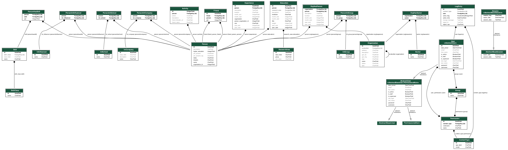

# Coral Framework

Coral é um framework para o mapeamento de comunidades empreendedoras. Nesta versão, mapeamos a comunidade empreendedora do estado do Rio de Janeiro no âmbito de empresas de tecnologia e respectivo ecossistema.

## Stack:

- Django framework
- Python 3.7
- jQuery
- HTML 5
- CSS 3
- Javascript

Por padrão o django está com o sqlite configurado como banco de dados. Até colocarmos o servidor no ar corretamente com o PostgreSQL. 

## Para executar o projeto, siga os seguintes passos:

Caso não tenha o Python3, instale-o utilizando o seguinte comando (mac):

`brew install python3`

Instale o Django em sua máquina (caso não tenha) seguindo a documentação, disponível aqui: 

https://docs.djangoproject.com/en/3.0/topics/install/

Clone o projeto utilizando o comando:
`git clone https://github.com/rafaelescalfoni/coral.git`

Navegue até o diretório do projeto via linha de comando:

`cd /diretório até o projeto no seu pc/coral/`

<!-- Para instalar bibliotecas necessárias (django_seed e django_extensions) use:

`pip3 install django-seed`

`pip3 install django-extensions` -->

Execute o comando para instalar as dependências necessárias:

`pip3 install -r requirements.txt`

Para rodar as migrações que constroem o banco de dados, execute no diretório do projeto o comando:

`python3.7 manage.py migrate`

ou

`python manage.py migrate`

Crie um usuário para acessar o sistema (vale ressaltar que o login jo Django é realizado com nome de usuário e não email)

`python3.7 manage.py createsuperuser`

Para dar start no django server utilize o comando:

`python3.7 manage.py runserver`

ou 

`python manage.py runserver`

Enjoy! ;)

## Diagrama do banco de dados

